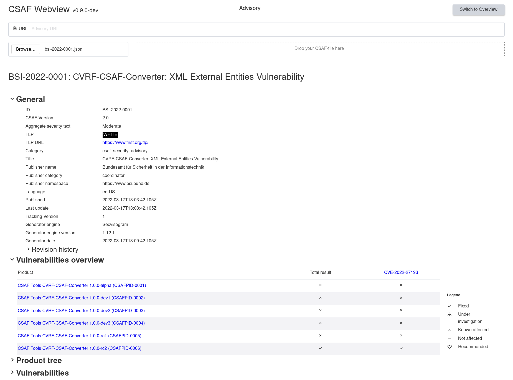
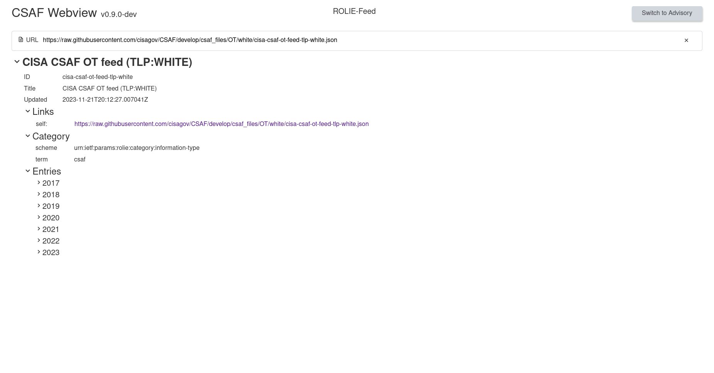

<!--
 This file is Free Software under the Apache-2.0 License
 without warranty, see README.md and LICENSES/Apache-2.0.txt for details.

 SPDX-License-Identifier: Apache-2.0

 SPDX-FileCopyrightText: 2023 German Federal Office for Information Security (BSI) <https://www.bsi.bund.de>
 Software-Engineering: 2023 Intevation GmbH <https://intevation.de>
-->

# CSAF Webview

A browser based web app (module) to:

- Display the contents of a
  [CSAF 2.0](https://docs.oasis-open.org/csaf/csaf/v2.0/csaf-v2.0.html)
  document.
- Browse the tree of documents offered by a CSAF Provider or mirror
  via the ROLIE feed.

Note: As of 2023-12-14 all but one server do not allow web applications
to read the CSAF information directly. So you will get failures
due to _CORS restrictions_ often.
See https://github.com/oasis-tcs/csaf/issues/653 for more details.

A backend can act as a proxy to avoid the problems caused by
CSAF Providers missing `Access-Control-Allow-Origin: *` headers.

The envisoned usage is to be integrated in a larger application.
Therefore, `csaf_webview` is kept simple and stylable.

## Feedback sought

> [!NOTE]
> If you have tried or considered using this component
> please contact us and explain your use cases.
>
> Please also let us know in case you are using webview and the reasons for its selection.
>
> Open an issue in this repo or send us an email, e.g. to
> [@bernhardreiter](https://github.com/bernhardreiter).

Background: Initially this web component was used
in [ISDuBA](https://github.com/ISDuBA/ISDuBA) and the plan
was to keep it external and by doing so, develop a more
universal component to display CSAF files.

During ISDuBA's development we've changed the approach,
integrated a copy of the code and made it ISDuBA specific instead.
Putting the focus on the needs of ISDuBA first
helped to understand more about what this real CSAF-handling application
needed from a viewing component. Mainly a deeper integration
with the handled use cases.
It is hard to display CSAF documents well;
which means fast and navigable that users will find the information
they want easily. Depending on their tasks, users profit from
tayloring the viewing experience.

Being ISDuBA specific means, we cannot easily
rip out the viewing component there and make it an external module again.
We could do a much better one now, but if other applications would need
a deeper integration as well anyway, they may or may not profit that much.

Which leaves us with the questions:

- Is a universal web viewing component (for displaying CSAF documents)
  feasable and useful?
- Is there is enough demand for it?

Thus we would like to hear from you about how close this component gets to what
you need to support displaying CSAF documents on the web
and what you would need from it. This helps us planning the maintenance.

### Screenshots



_Displaying a single document_


_Displaying a ROLIE-Feed_

The deployment via github pages is a demo
and thus may not reflect the current state of the source repository.

## Development

### Clone the repo

`git clone https://github.com/csaf-poc/csaf_webview.git`

### `cd` into app directory

`cd csaf_webview`

### Install dependencies

Install current LTS version of NodeJS, e.g. see
https://github.com/nodesource/distributions/blob/master/README.md .
Upgrade to the latest version of npm if you can.
Development has been started with Node v20 and npm 10.2.1

```sh
npm install
npx playwright install
```

### Run development server

Optionally add `-- --open` to directly open a browser.

`npm run dev -- --open`

### Drag a valid csaf-file over the `dropzone`.

### Run unit tests

`npm run test:unit`

### Run integration tests

`npm run test:integration`

### Run unit tests coverage

`npm run coverage`

### Deploy new version of GH page

`npm run build:ghpage`
`npm run deploy`

## Configure a local proxysetup

In order to configure a proxy server use `vite.config.js`.
The default configuration is:

```javascript
...
server: {
    proxy: {
      "/proxy/": {
        target: "https://wid.cert-bund.de/",
        changeOrigin: true,
        rewrite: (path) => path.replace(/^\/proxy/, "")
      }
    }
  },
...
```

For more information look [here](https://vitejs.dev/config/server-options.html#server-proxy).

Change target to the URL to be proxied.

## License

- csaf_webview is licensed as Free Software under Apache-2.0 License.

- See the specific source files
  for details, the licenses itself can be found in the directory `LICENSES/`.

- The resulting webpage contains third party Free Software components under
  licenses that to our best knowledge are compatible at time of adding
  the dependency. See `package.json` for details.
