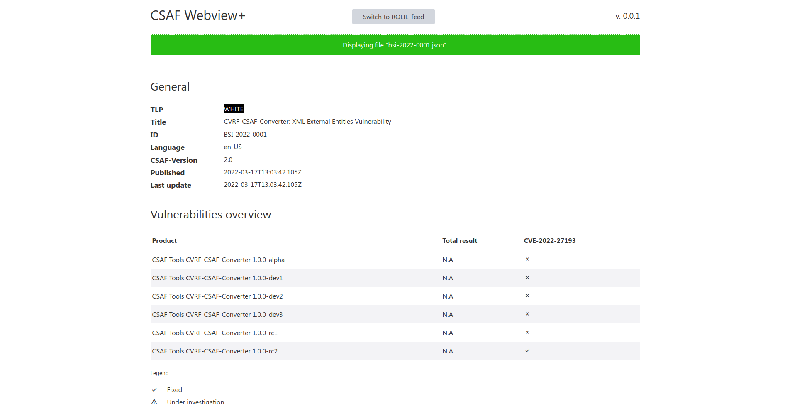

<!--
 This file is Free Software under the MIT License
 without warranty, see README.md and LICENSES/MIT.txt for details.

 SPDX-License-Identifier: MIT

 SPDX-FileCopyrightText: 2023 German Federal Office for Information Security (BSI) <https://www.bsi.bund.de>
 Software-Engineering: 2023 Intevation GmbH <https://intevation.de
-->
# Webview+

Lorem ipsum dolor sit amet, consetetur sadipscing elitr, sed diam nonumy eirmod tempor invidunt ut labore et dolore magna aliquyam erat, sed diam voluptua. At vero eos et accusam et justo duo dolores et ea rebum. Stet clita kasd gubergren, no sea takimata sanctus est Lorem ipsum dolor sit amet. Lorem ipsum dolor sit amet, consetetur sadipscing elitr, sed diam nonumy eirmod tempor invidunt ut labore et dolore magna aliquyam erat, sed diam voluptua. At vero eos et accusam et justo duo dolores et ea rebum. Stet clita kasd gubergren, no sea takimata sanctus est Lorem ipsum dolor sit amet.



## Development

### Clone the repo

```git clone https://github.com/csaf-poc/csaf_webview.git```

### `cd` into app directory

```cd csaf_webview```

### Install dependencies

```npm install```

### Run development server and `--open` a browser.

```npm run dev -- --open```

### Drag a valid csaf-file over the `dropzone`.
